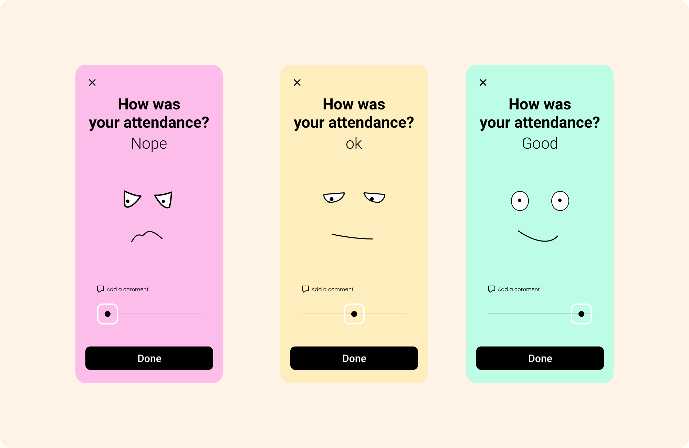
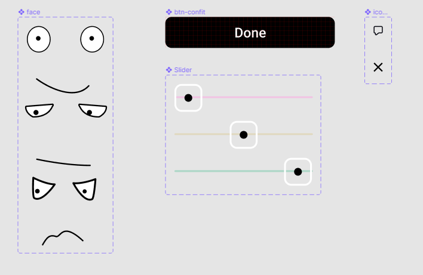

# EmotionalSliderAnimation - from Cuberto

The main idea was test some abilities using SVG, CSS and Vanilla JS to create this fun UI interaction.

## UI project inspired by Cuberto:

[Emotional Slider Animation in After Effects](https://cuberto.com/tutorials/8/)

### Project UI (recreated by me)

[Project link - Enjoy it 😊](https://lucaspdroz.github.io/EmotionalSliderAnimation-Cuberto/)

### Project Screens

### Figma components

